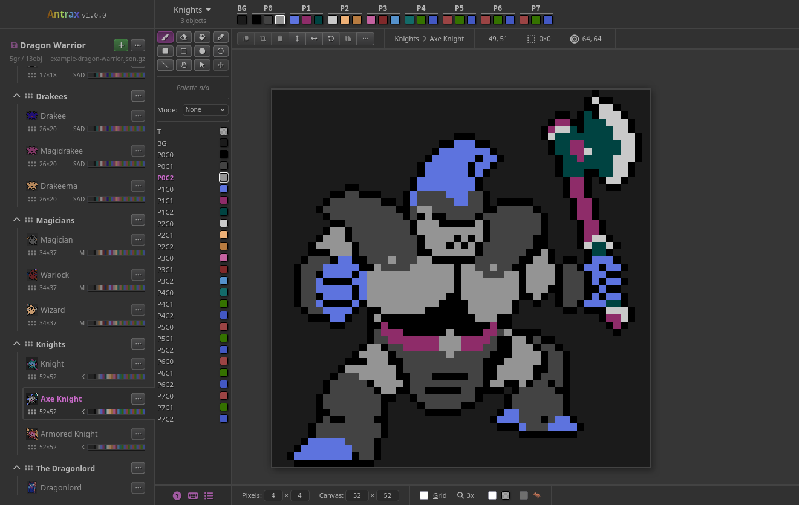
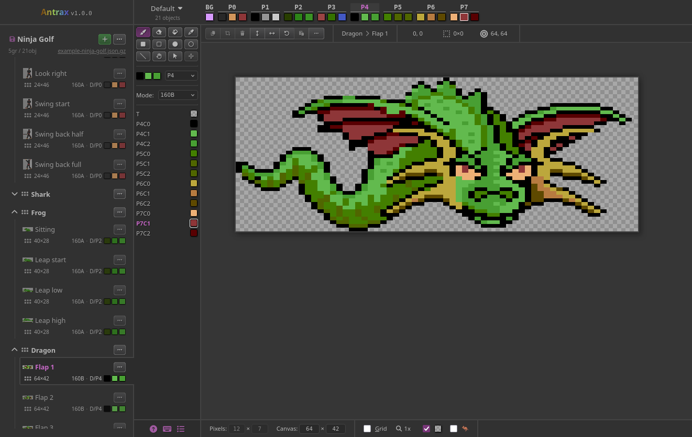
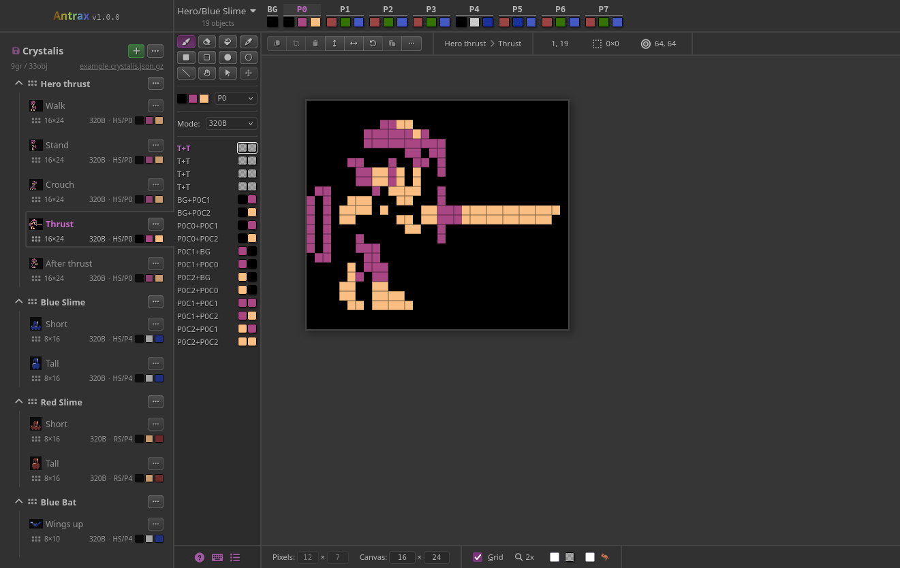
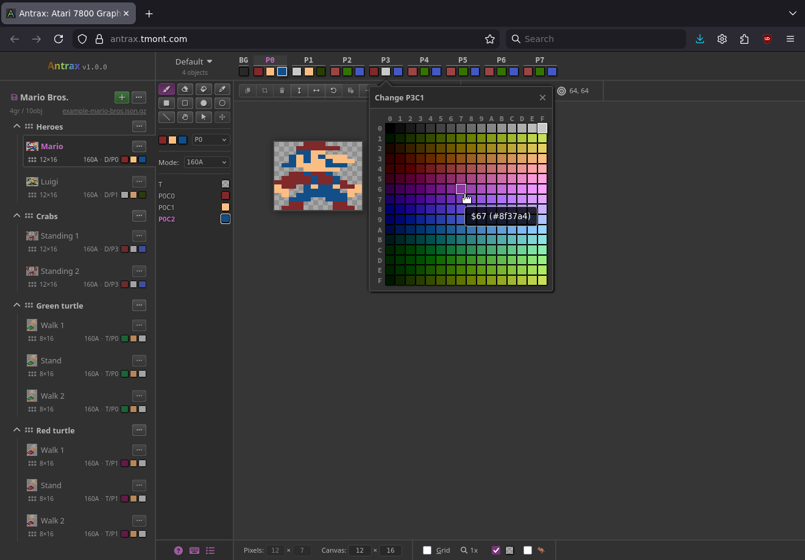
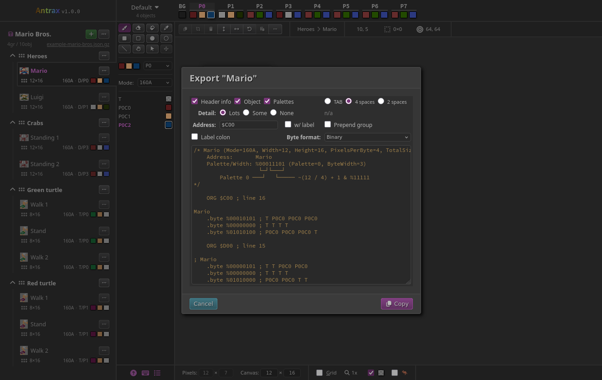
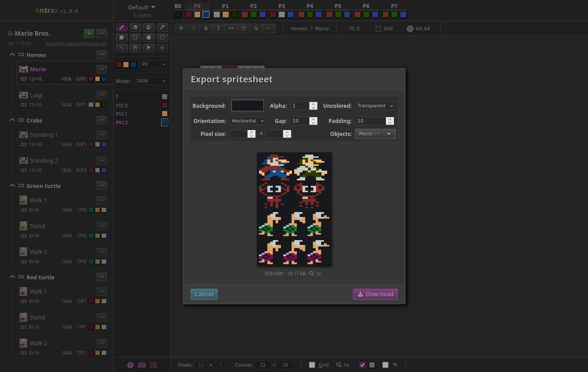
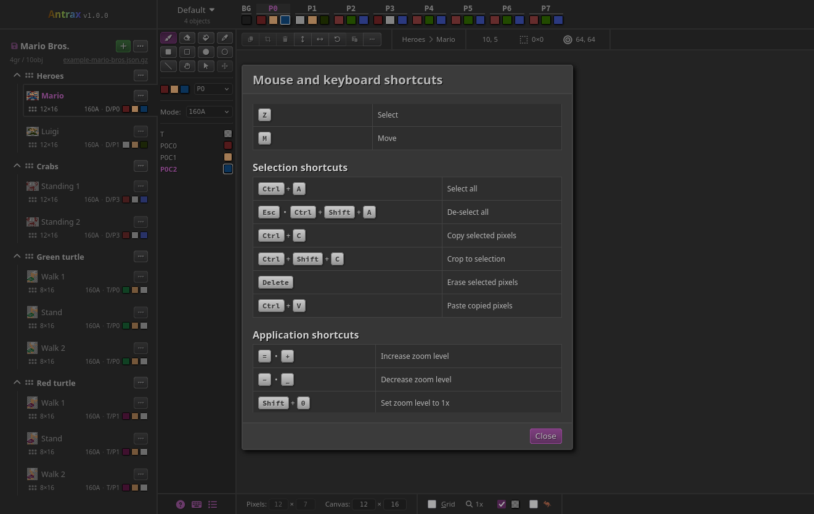
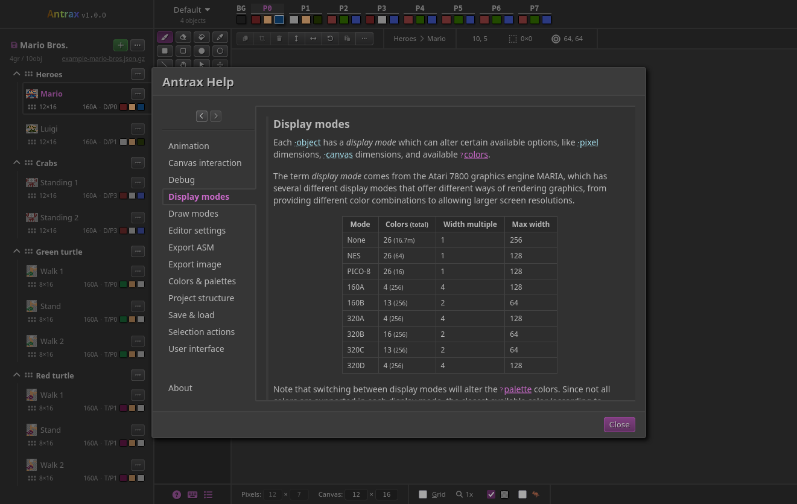

# Antrax

A pixel art editor geared toward the Atari 7800.



Main site: https://antrax.tmont.com/

Changelog: [CHANGELOG.md](./CHANGELOG.md)

## Features
### Editor features
- Zooming
- Grid
- Customizable canvas size
- Customizable pixel size
- Shape drawing (rectangle/ellipse/line)
- Select/copy/paste/move parts of the canvas
- Fill/Eye-dropper/Erase
- Save/load from/to external files 
- Automatic save+restore to `localStorage`
- Edit/manage multiple named graphics objects
- Clone existing graphics object
- Export to image/spritesheet
- View sprite animations
- Color palette management
- Lots of keyboard shortcuts
- Extensive in-app help documentation
- Touch support
- Horizontal/vertical flip
- Rotate

### Atari 7800-specific features
- Export object/header/palettes to ASM
- Color picker for all 256 supported colors
- Kangaroo mode support
- Switch between all display modes (160A/B, 320A/B/C/D)
- Color palette logic
- Object width is clamped to what the display mode supports

### Other features
- NES color palette (64 colors)
- PICO-8 color palette (8 + 8 "hidden" colors)

## Screenshots
<details>
<summary>Antrax screenshots</summary>

### Atari 7800 sprites
#### 160 display mode


#### 320 display mode


### Color picker


### Export assembly


### Export image


### Keyboard shortcuts


### In-app help documentation


</details>

## Development
### Prerequisites
1. [Bun](https://bun.com/docs/installation)
2. [Dart Sass](https://github.com/sass/dart-sass/releases)
    - install it to `.dev/` such that the path to the `sass` executable is
      `.dev/dart-sass/sass`

## Development

1. `bun install`
2. `bun run build`
3. In another terminal, `bun run start`
4. In another terminal, `bun run sass`
5. Visit http://localhost:11000/

### SVG sprite
Run `scripts/svg-inline.sh` to create an inline SVG sprite from the files
in `public/images/svg/`. For a file named `foo-bar.svg`, use like so:

```html
<i class="icon icon-svg"><svg><use href="#svg-foo-bar"/></svg></i>
```

## Deployment
You will need normal shell tools (`rsync`, `perl`, `git`) in addition to `pandoc` (for rendering
the changelog to HTML).

The release script has only been tested on Linux.

1. Create `.dev/.env` with `RELEASE_REMOTE_HOST` and `RELEASE_REMOTE_DIR` definitions, e.g.
    ```bash
    RELEASE_REMOTE_HOST=atari7800gfx.example.com
    RELEASE_REMOTE_DIR=/var/www/atari7800gfx.example.com
   ```
2. Run `scripts/release.sh`
