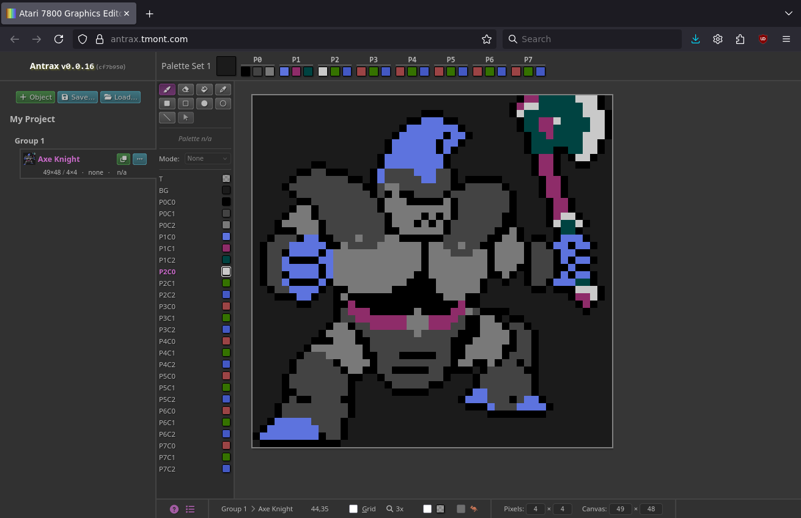
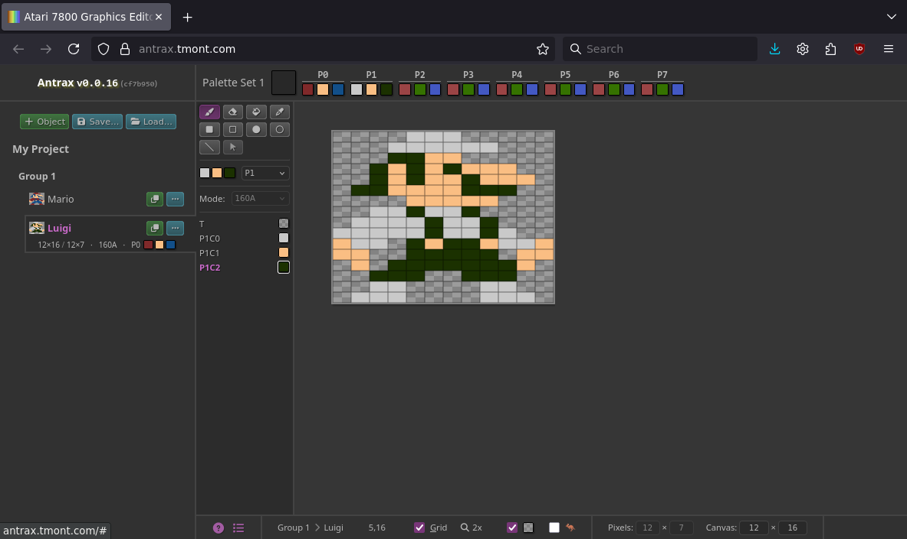
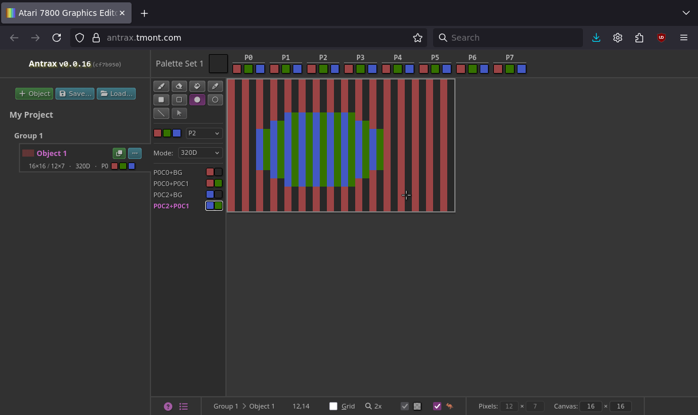
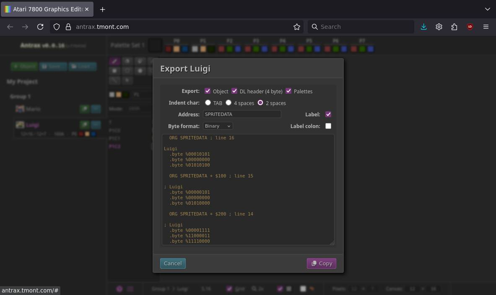

# Antrax

A graphics editor for the Atari 7800. 

As far as I understand things, character/tile data is not supported.

It is also a (very limited) general purpose pixel art editor, insomuch as at the
moment you can only use colors supported by the Atari 7800.

Main site: https://antrax.tmont.com/

Changelog: [CHANGELOG.md](./CHANGELOG.md)

## Features
### Editor features
- Zooming (1x to 10x)
- Grid
- Customizable canvas size
- Customizable pixel size (locked to 12x7 when using an Atari 7800 display mode)
- Shape drawing (rectangle/ellipse/line)
- Fill/Eye-dropper/Erase
- Save/load from/to external files
- Edit/manage multiple named graphics objects
- Clone existing graphics object
- Export to image
- Color palette management
- Lots of keyboard shortcuts

### Atari 7800-specific features
- Export object/header/palettes to ASM
- Color picker for supported colors
- Toggle kangaroo mode
- Switch between all display modes (160A/B, 320A/B/C/D)
- Color palette logic
- Object width is clamped to what the display mode supports

## Screenshots
<details>
<summary>Antrax screenshots</summary>

### Generic pixel art


### Atari 7800 sprites


### Color picker


### Display modes


### Export

</details>

## Development
### Prerequisites
1. [Bun](https://bun.com/docs/installation)
2. [Dart Sass](https://github.com/sass/dart-sass/releases)
    - install it to `.dev/` such that the path to the `sass` executable is
      `.dev/dart-sass/sass`

## Development

1. `bun install`
2. `bun run build`
3. In another terminal, `bun run start`
4. In another terminal, `bun run sass`
5. Visit http://localhost:11000/

## Deployment
You will need normal shell tools (`rsync`, `perl`, `git`) in addition to `pandoc` (for rendering
CHANGELOG.md to HTML).

The release script has only been tested on Linux.

1. Create `.dev/.env` with `RELEASE_REMOTE_HOST` and `RELEASE_REMOTE_DIR` definitions, e.g.
    ```bash
    RELEASE_REMOTE_HOST=atari7800gfx.example.com
    RELEASE_REMOTE_DIR=/var/www/atari7800gfx.example.com
   ```
2. Run `scripts/release.sh`
